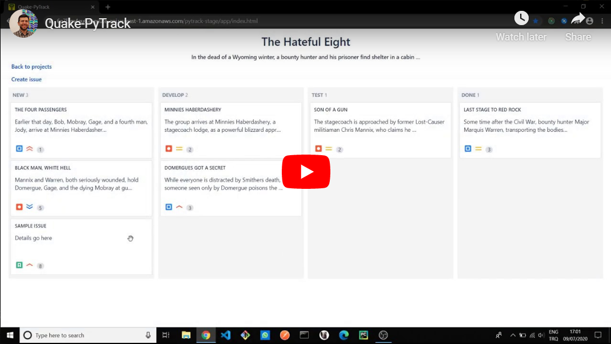

### Quake-PyTrack: Project management system

##### Preview

##### Watch in HD

[Frontend Code](https://github.com/eozgit/pytrack-amp)

###### Stack
-   Python
-   Flask
-   SqlAlchemy
-   PostgreSQL
-   React
-   Redux
-   TypeScript
-   Docker
-   Amazon EC2
-   Amazon RDS
-   AWS Amplify
-   Amazon Cognito
-   Amazon API Gateway

###### Features
-   AWS Cognito authentication
-   CRUD Projects
-   CRUD Issues
-   Kanban board
